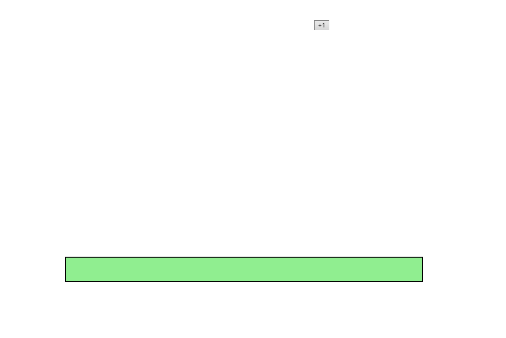

# Magicbutton

## Importar directorio en máquina local la primera vez

> git clone https://github.com/Elardillo2002/Magicbutton.git

## Actualizar cambios (main)

> git fetch origin main
> git merge origin/main

## Exportar a github (main)

> git add .
> git commit -m "commit"
> git push origin main

